```python
from IPython.core.interactiveshell import InteractiveShell
InteractiveShell.ast_node_interactivity='all'
```


```python
from IPython.display import Image
```


```python
#Image("C:\\Users\\user\\Desktop\\ML_ADV\\2\\Rules.PNG")
```


```python
import numpy as np
import pandas as pd
import matplotlib.pyplot as plt
import seaborn as sns
%matplotlib inline
```


```python
# Importing the Retail Data
df = pd.read_csv("D:\\01 - MBA Business Analytics\\04 _G_Learning\\Mall_Customers.csv", encoding = "unicode_escape")
```


```python
df.head()
```


<div>
<style scoped>
    .dataframe tbody tr th:only-of-type {
        vertical-align: middle;
    }

    .dataframe tbody tr th {
        vertical-align: top;
    }

    .dataframe thead th {
        text-align: right;
    }
</style>
<table border="1" class="dataframe">
  <thead>
    <tr style="text-align: right;">
      <th></th>
      <th>CustomerID</th>
      <th>Genre</th>
      <th>Age</th>
      <th>Annual Income (k$)</th>
      <th>Spending Score (1-100)</th>
    </tr>
  </thead>
  <tbody>
    <tr>
      <th>0</th>
      <td>1</td>
      <td>Male</td>
      <td>19</td>
      <td>15</td>
      <td>39</td>
    </tr>
    <tr>
      <th>1</th>
      <td>2</td>
      <td>Male</td>
      <td>21</td>
      <td>15</td>
      <td>81</td>
    </tr>
    <tr>
      <th>2</th>
      <td>3</td>
      <td>Female</td>
      <td>20</td>
      <td>16</td>
      <td>6</td>
    </tr>
    <tr>
      <th>3</th>
      <td>4</td>
      <td>Female</td>
      <td>23</td>
      <td>16</td>
      <td>77</td>
    </tr>
    <tr>
      <th>4</th>
      <td>5</td>
      <td>Female</td>
      <td>31</td>
      <td>17</td>
      <td>40</td>
    </tr>
  </tbody>
</table>
</div>


```python
df.rename(columns={'Genre':'Gender'},inplace = True)
```


```python
df.head()
```


<div>
<style scoped>
    .dataframe tbody tr th:only-of-type {
        vertical-align: middle;
    }

    .dataframe tbody tr th {
        vertical-align: top;
    }

    .dataframe thead th {
        text-align: right;
    }
</style>
<table border="1" class="dataframe">
  <thead>
    <tr style="text-align: right;">
      <th></th>
      <th>CustomerID</th>
      <th>Gender</th>
      <th>Age</th>
      <th>Annual Income (k$)</th>
      <th>Spending Score (1-100)</th>
    </tr>
  </thead>
  <tbody>
    <tr>
      <th>0</th>
      <td>1</td>
      <td>Male</td>
      <td>19</td>
      <td>15</td>
      <td>39</td>
    </tr>
    <tr>
      <th>1</th>
      <td>2</td>
      <td>Male</td>
      <td>21</td>
      <td>15</td>
      <td>81</td>
    </tr>
    <tr>
      <th>2</th>
      <td>3</td>
      <td>Female</td>
      <td>20</td>
      <td>16</td>
      <td>6</td>
    </tr>
    <tr>
      <th>3</th>
      <td>4</td>
      <td>Female</td>
      <td>23</td>
      <td>16</td>
      <td>77</td>
    </tr>
    <tr>
      <th>4</th>
      <td>5</td>
      <td>Female</td>
      <td>31</td>
      <td>17</td>
      <td>40</td>
    </tr>
  </tbody>
</table>
</div>


```python
# To check number of columns and rows
df.shape
```


    (200, 5)


```python
df.describe()
```


<div>
<style scoped>
    .dataframe tbody tr th:only-of-type {
        vertical-align: middle;
    }

    .dataframe tbody tr th {
        vertical-align: top;
    }

    .dataframe thead th {
        text-align: right;
    }
</style>
<table border="1" class="dataframe">
  <thead>
    <tr style="text-align: right;">
      <th></th>
      <th>CustomerID</th>
      <th>Age</th>
      <th>Annual Income (k$)</th>
      <th>Spending Score (1-100)</th>
    </tr>
  </thead>
  <tbody>
    <tr>
      <th>count</th>
      <td>200.000000</td>
      <td>200.000000</td>
      <td>200.000000</td>
      <td>200.000000</td>
    </tr>
    <tr>
      <th>mean</th>
      <td>100.500000</td>
      <td>38.850000</td>
      <td>60.560000</td>
      <td>50.200000</td>
    </tr>
    <tr>
      <th>std</th>
      <td>57.879185</td>
      <td>13.969007</td>
      <td>26.264721</td>
      <td>25.823522</td>
    </tr>
    <tr>
      <th>min</th>
      <td>1.000000</td>
      <td>18.000000</td>
      <td>15.000000</td>
      <td>1.000000</td>
    </tr>
    <tr>
      <th>25%</th>
      <td>50.750000</td>
      <td>28.750000</td>
      <td>41.500000</td>
      <td>34.750000</td>
    </tr>
    <tr>
      <th>50%</th>
      <td>100.500000</td>
      <td>36.000000</td>
      <td>61.500000</td>
      <td>50.000000</td>
    </tr>
    <tr>
      <th>75%</th>
      <td>150.250000</td>
      <td>49.000000</td>
      <td>78.000000</td>
      <td>73.000000</td>
    </tr>
    <tr>
      <th>max</th>
      <td>200.000000</td>
      <td>70.000000</td>
      <td>137.000000</td>
      <td>99.000000</td>
    </tr>
  </tbody>
</table>
</div>


```python
# To check the data types 
df.dtypes
```


    CustomerID                 int64
    Gender                    object
    Age                        int64
    Annual Income (k$)         int64
    Spending Score (1-100)     int64
    dtype: object


```python
# To check for the missing Values
df.isnull().sum()
```


    CustomerID                0
    Gender                    0
    Age                       0
    Annual Income (k$)        0
    Spending Score (1-100)    0
    dtype: int64


```python
# Droping the customer ID column as it is not required
df.drop(['CustomerID'],axis=1, inplace=True)
```


```python
df.head()
```


<div>
<style scoped>
    .dataframe tbody tr th:only-of-type {
        vertical-align: middle;
    }

    .dataframe tbody tr th {
        vertical-align: top;
    }

    .dataframe thead th {
        text-align: right;
    }
</style>
<table border="1" class="dataframe">
  <thead>
    <tr style="text-align: right;">
      <th></th>
      <th>Gender</th>
      <th>Age</th>
      <th>Annual Income (k$)</th>
      <th>Spending Score (1-100)</th>
    </tr>
  </thead>
  <tbody>
    <tr>
      <th>0</th>
      <td>Male</td>
      <td>19</td>
      <td>15</td>
      <td>39</td>
    </tr>
    <tr>
      <th>1</th>
      <td>Male</td>
      <td>21</td>
      <td>15</td>
      <td>81</td>
    </tr>
    <tr>
      <th>2</th>
      <td>Female</td>
      <td>20</td>
      <td>16</td>
      <td>6</td>
    </tr>
    <tr>
      <th>3</th>
      <td>Female</td>
      <td>23</td>
      <td>16</td>
      <td>77</td>
    </tr>
    <tr>
      <th>4</th>
      <td>Female</td>
      <td>31</td>
      <td>17</td>
      <td>40</td>
    </tr>
  </tbody>
</table>
</div>


```python
# Distribution plot 
plt.figure(1, figsize=(15,6))
n = 0
for x in ['Age','Annual Income (k$)','Spending Score (1-100)']:
    n = n + 1
    plt.subplot(1,3,n)
    plt.subplots_adjust(hspace = 0.5, wspace = 0.5)
    sns.distplot(df[x], bins = 20)
    plt.title('Distplot of {}'.format(x))
plt.show()
```


    <Figure size 1080x432 with 0 Axes>


    <matplotlib.axes._subplots.AxesSubplot at 0x20a326a7670>


    <matplotlib.axes._subplots.AxesSubplot at 0x20a326a7670>


    Text(0.5, 1.0, 'Distplot of Age')


    <matplotlib.axes._subplots.AxesSubplot at 0x20a326e7460>


    <matplotlib.axes._subplots.AxesSubplot at 0x20a326e7460>


    Text(0.5, 1.0, 'Distplot of Annual Income (k$)')


    <matplotlib.axes._subplots.AxesSubplot at 0x20a327678b0>


    <matplotlib.axes._subplots.AxesSubplot at 0x20a327678b0>


    Text(0.5, 1.0, 'Distplot of Spending Score (1-100)')


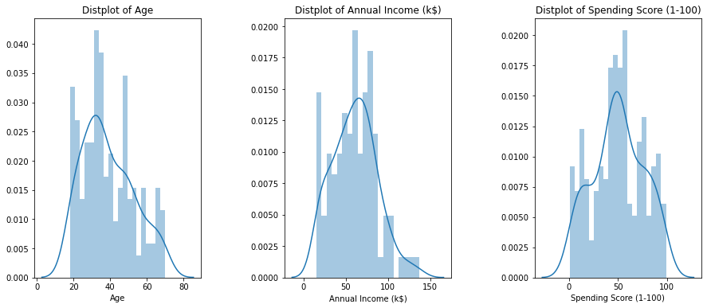


```python
# plt.figure(1, figsize=(15,6))
# plt.subplots_adjust(hspace = 0.5, wspace = 0.5)
# sns.distplot(df['Age'], bins = 20)
# plt.title('Distplot of Age')
# plt.show()
```


```python
# Comparision of Number males to females
plt.figure(1, figsize=(15,5))
sns.countplot(y='Gender', data=df)
plt.show()
```


    <Figure size 1080x360 with 0 Axes>


    <matplotlib.axes._subplots.AxesSubplot at 0x20a32727400>


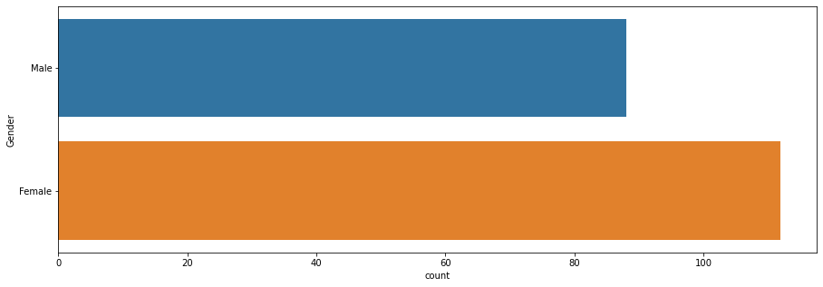


```python
# Distribution plot based on Gender
plt.figure(1, figsize=(15,6))
n = 0
for cols in ['Age','Annual Income (k$)','Spending Score (1-100)']:
    n = n + 1
    plt.subplot(1,3,n)
    sns.set(style='whitegrid')
    plt.subplots_adjust(hspace = 0.5, wspace = 0.5)
    sns.violinplot(x = cols, y = 'Gender', data = df)
    plt.ylabel('Gender' if n == 1 else "")
    plt.title('Violin Plot')
plt.show()
```


    <Figure size 1080x432 with 0 Axes>


    <matplotlib.axes._subplots.AxesSubplot at 0x20a32846070>


    <matplotlib.axes._subplots.AxesSubplot at 0x20a32846070>


    Text(0, 0.5, 'Gender')


    Text(0.5, 1.0, 'Violin Plot')


    <matplotlib.axes._subplots.AxesSubplot at 0x20a32c75040>


    <matplotlib.axes._subplots.AxesSubplot at 0x20a32c75040>


    Text(0, 0.5, '')


    Text(0.5, 1.0, 'Violin Plot')


    <matplotlib.axes._subplots.AxesSubplot at 0x20a32cc0fa0>


    <matplotlib.axes._subplots.AxesSubplot at 0x20a32cc0fa0>


    Text(0, 0.5, '')


    Text(0.5, 1.0, 'Violin Plot')


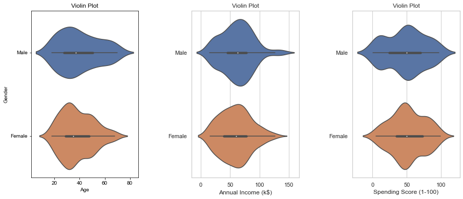


```python
age_18_25 = df['Age'][(df.Age >=18) & (df.Age <= 25)]
age_26_35 = df.Age[(df.Age >=26) & (df.Age <= 35)]
age_36_45 = df.Age[(df.Age >=36) & (df.Age <= 45)]
age_46_55 = df.Age[(df.Age >=46) & (df.Age <= 55)]
age_55above = df.Age[df.Age >=56]

agex = ["18-25","26-35","36-45","46-55","56+"]
agey = [len(age_18_25.values),len(age_26_35.values),len(age_36_45.values),len(age_46_55.values),len(age_55above.values)]

plt.figure(1, figsize=(15,6))
sns.barplot(x=agex, y=agey, palette = 'mako')
plt.title('Number of Customer and Ages')
plt.xlabel('Age')
plt.ylabel('Number of Customer')
plt.show()

```


    <Figure size 1080x432 with 0 Axes>


    <matplotlib.axes._subplots.AxesSubplot at 0x20a32a95070>


    Text(0.5, 1.0, 'Number of Customer and Ages')


    Text(0.5, 0, 'Age')


    Text(0, 0.5, 'Number of Customer')


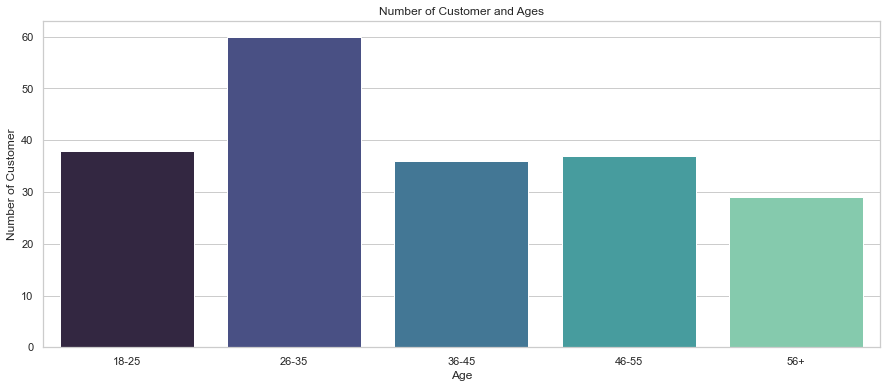


```python
# Relationship between Anual income and spending Score
sns.relplot(x = 'Annual Income (k$)', y = 'Spending Score (1-100)', data=df)
```


    <seaborn.axisgrid.FacetGrid at 0x20a32d60a30>


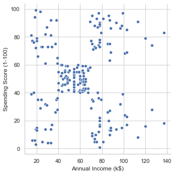


```python
ss_1_20 = df["Spending Score (1-100)"][(df["Spending Score (1-100)"] >=1) & (df["Spending Score (1-100)"] <= 20)]
ss_21_40 = df["Spending Score (1-100)"][(df["Spending Score (1-100)"] >=21) & (df["Spending Score (1-100)"] <= 40)]
ss_41_60 = df["Spending Score (1-100)"][(df["Spending Score (1-100)"] >=41) & (df["Spending Score (1-100)"] <= 60)]
ss_61_80 = df["Spending Score (1-100)"][(df["Spending Score (1-100)"] >=61) & (df["Spending Score (1-100)"] <= 80)]
ss_81_100 = df["Spending Score (1-100)"][(df["Spending Score (1-100)"] >=81) & (df["Spending Score (1-100)"] <= 100)]

ssx = ["1_20","21_40","41_60","61_80","81_100"]
ssy = [len(ss_1_20.values),len(ss_21_40.values),len(ss_41_60.values),len(ss_61_80.values),len(ss_81_100.values)]

plt.figure(1, figsize=(15,6))
sns.barplot(x=ssx, y=ssy, palette = 'mako')
plt.title('Spending Scores')
plt.xlabel('Score')
plt.ylabel('Number of Customer having the Score')
plt.show()

```


    <Figure size 1080x432 with 0 Axes>


    <matplotlib.axes._subplots.AxesSubplot at 0x20a32dbff70>


    Text(0.5, 1.0, 'Spending Scores')


    Text(0.5, 0, 'Score')


    Text(0, 0.5, 'Number of Customer having the Score')


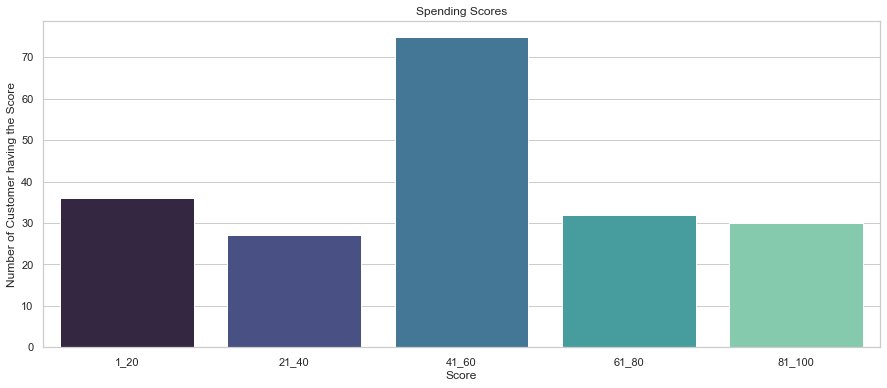


```python
ss_1_20.values
type(ss_1_20.values)
```


    array([ 6,  6,  3, 14, 15, 13,  5, 14,  4,  4, 14, 17, 11,  9,  5,  7, 10,
            5, 12, 17, 20, 16,  1,  1,  5, 20, 13, 10, 13, 15, 14, 15, 17,  8,
           16, 18], dtype=int64)


    numpy.ndarray


```python
ai0_30 = df["Annual Income (k$)"][(df["Annual Income (k$)"] >=0) & (df["Annual Income (k$)"] <= 30)]
ai31_60 = df["Annual Income (k$)"][(df["Annual Income (k$)"] >=31) & (df["Annual Income (k$)"] <= 60)]
ai61_90 = df["Annual Income (k$)"][(df["Annual Income (k$)"] >=61) & (df["Annual Income (k$)"] <= 90)]
ai91_120 = df["Annual Income (k$)"][(df["Annual Income (k$)"] >=91) & (df["Annual Income (k$)"] <= 120)]
ai121_150 = df["Annual Income (k$)"][(df["Annual Income (k$)"] >=121) & (df["Annual Income (k$)"] <= 150)]

aix = ["$_0_30","$_31_60","$_61_90","$_91_120","$_121_150"]
aiy = [len(ai0_30.values),len(ai31_60.values),len(ai61_90.values),len(ai91_120.values),len(ai121_150.values)]

plt.figure(1, figsize=(15,6))
sns.barplot(x=aix, y=aiy, palette = 'Spectral')
plt.title('Annual Income (k$)')
plt.xlabel('Income')
plt.ylabel('Number of Customer')
plt.show()
```


    <Figure size 1080x432 with 0 Axes>


    <matplotlib.axes._subplots.AxesSubplot at 0x20a3293fe50>


    Text(0.5, 1.0, 'Annual Income (k$)')


    Text(0.5, 0, 'Income')


    Text(0, 0.5, 'Number of Customer')


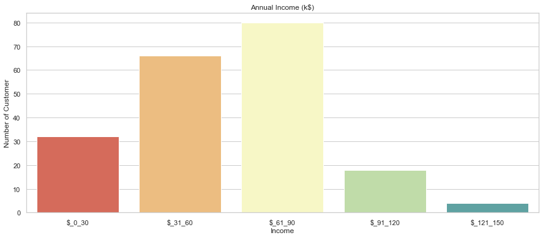


```python
# Modelling
```


```python
# Custer based on Age and Spending Score
```


```python
X1 = df.loc[:,['Age','Spending Score (1-100)']].values
```


```python
from sklearn.cluster import KMeans
wcss = []
for k in range(1,11):
    kmeans = KMeans(n_clusters=k, init='k-means++')
    kmeans.fit(X1)
    wcss.append(kmeans.inertia_)
plt.figure(figsize=(12,6))
plt.grid()
plt.plot(range(1,11),wcss,linewidth = 2, color = "red", marker = "8")
plt.xlabel('K Values')
plt.ylabel("WCSS")
plt.show()
```


    KMeans(n_clusters=1)


    KMeans(n_clusters=2)


    KMeans(n_clusters=3)


    KMeans(n_clusters=4)


    KMeans(n_clusters=5)


    KMeans(n_clusters=6)


    KMeans(n_clusters=7)


    KMeans()


    KMeans(n_clusters=9)


    KMeans(n_clusters=10)


    <Figure size 864x432 with 0 Axes>


    [<matplotlib.lines.Line2D at 0x20a32a56190>]


    Text(0.5, 0, 'K Values')


    Text(0, 0.5, 'WCSS')


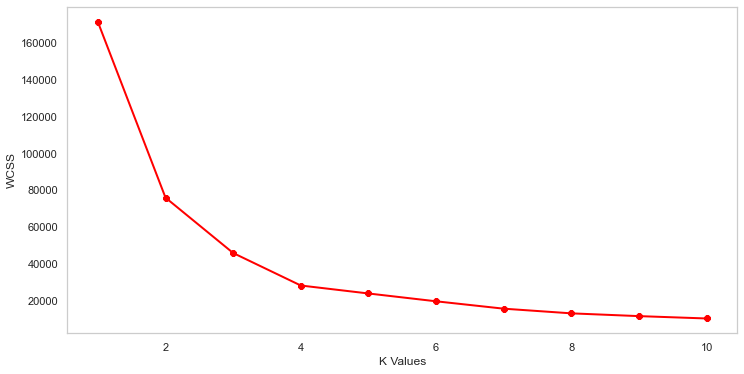


```python
kmeans = KMeans(n_clusters=4)
label = kmeans.fit_predict(X1)
print(label)
```

    [3 0 1 0 3 0 1 0 1 0 1 0 1 0 1 0 3 3 1 0 3 0 1 0 1 0 1 3 1 0 1 0 1 0 1 0 1
     0 1 0 2 0 2 3 1 3 2 3 3 3 2 3 3 2 2 2 2 2 3 2 2 3 2 2 2 3 2 2 3 3 2 2 2 2
     2 3 2 3 3 2 2 3 2 2 3 2 2 3 3 2 2 3 2 3 3 3 2 3 2 3 3 2 2 3 2 3 2 2 2 2 2
     3 3 3 3 3 2 2 2 2 3 3 3 0 3 0 2 0 1 0 1 0 3 0 1 0 1 0 1 0 1 0 3 0 1 0 2 0
     1 0 1 0 1 0 1 0 1 0 1 0 2 0 1 0 1 0 1 0 1 3 1 0 1 0 1 0 1 0 1 0 1 0 1 0 3
     0 1 0 1 0 1 0 1 0 1 0 1 0 1 0]
    


```python
print(kmeans.cluster_centers_)
```

    [[30.1754386  82.35087719]
     [43.29166667 15.02083333]
     [55.70833333 48.22916667]
     [27.61702128 49.14893617]]
    


```python
# Custer based on Age and Spending Score (Scatter Plot)
```


```python
plt.scatter(X1[:,0], X1[:,1], c=kmeans.labels_, cmap='rainbow')
plt.scatter(kmeans.cluster_centers_[:,0] ,kmeans.cluster_centers_[:,1], color = 'black')
plt.title('Clusters Of Customers')
plt.xlabel('Age')
plt.ylabel('Spending Score(1-100)')
plt.show()
```


    <matplotlib.collections.PathCollection at 0x20a331faf40>


    <matplotlib.collections.PathCollection at 0x20a3288fc70>


    Text(0.5, 1.0, 'Clusters Of Customers')


    Text(0.5, 0, 'Age')


    Text(0, 0.5, 'Spending Score(1-100)')


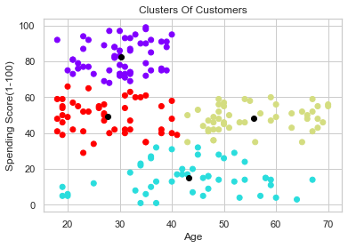


```python
# Custer based on Annual Income and Spending Score
```


```python

```


```python
X2 = df.loc[:,["Annual Income (k$)",'Spending Score (1-100)']].values
```


```python
from sklearn.cluster import KMeans
wcss = []
for k in range(1,11):
    kmeans = KMeans(n_clusters=k, init='k-means++')
    kmeans.fit(X2)
    wcss.append(kmeans.inertia_)
plt.figure(figsize=(12,6))
plt.grid()
plt.plot(range(1,11),wcss,linewidth = 2, color = "red", marker = "8")
plt.xlabel('K Values')
plt.ylabel("WCSS")
plt.show()
```


    KMeans(n_clusters=1)


    KMeans(n_clusters=2)


    KMeans(n_clusters=3)


    KMeans(n_clusters=4)


    KMeans(n_clusters=5)


    KMeans(n_clusters=6)


    KMeans(n_clusters=7)


    KMeans()


    KMeans(n_clusters=9)


    KMeans(n_clusters=10)


    <Figure size 864x432 with 0 Axes>


    [<matplotlib.lines.Line2D at 0x20a33252d30>]


    Text(0.5, 0, 'K Values')


    Text(0, 0.5, 'WCSS')


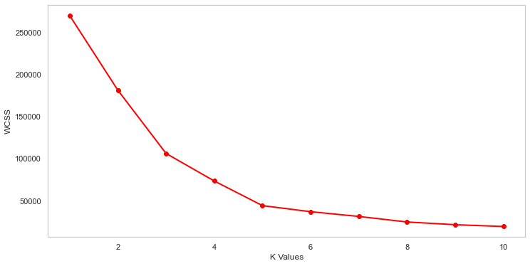


```python
# Custer based on Annual Income and Spending Score (Scatter Plot)
```


```python
kmeans = KMeans(n_clusters=5)
label = kmeans.fit_predict(X2)
print(label)
```

    [3 2 3 2 3 2 3 2 3 2 3 2 3 2 3 2 3 2 3 2 3 2 3 2 3 2 3 2 3 2 3 2 3 2 3 2 3
     2 3 2 3 2 3 0 3 2 0 0 0 0 0 0 0 0 0 0 0 0 0 0 0 0 0 0 0 0 0 0 0 0 0 0 0 0
     0 0 0 0 0 0 0 0 0 0 0 0 0 0 0 0 0 0 0 0 0 0 0 0 0 0 0 0 0 0 0 0 0 0 0 0 0
     0 0 0 0 0 0 0 0 0 0 0 0 1 4 1 0 1 4 1 4 1 0 1 4 1 4 1 4 1 4 1 0 1 4 1 4 1
     4 1 4 1 4 1 4 1 4 1 4 1 4 1 4 1 4 1 4 1 4 1 4 1 4 1 4 1 4 1 4 1 4 1 4 1 4
     1 4 1 4 1 4 1 4 1 4 1 4 1 4 1]
    


```python
print(kmeans.cluster_centers_)
```

    [[55.2962963  49.51851852]
     [86.53846154 82.12820513]
     [25.72727273 79.36363636]
     [26.30434783 20.91304348]
     [88.2        17.11428571]]
    


```python
plt.scatter(X2[:,0], X2[:,1], c=kmeans.labels_, cmap='rainbow')
plt.scatter(kmeans.cluster_centers_[:,0] ,kmeans.cluster_centers_[:,1], color = 'black')
plt.title('Clusters Of Customers')
plt.xlabel('Age')
plt.ylabel('Spending Score(1-100)')
plt.show()
```


    <matplotlib.collections.PathCollection at 0x20a3329cd90>


    <matplotlib.collections.PathCollection at 0x20a32670e20>


    Text(0.5, 1.0, 'Clusters Of Customers')


    Text(0.5, 0, 'Age')


    Text(0, 0.5, 'Spending Score(1-100)')


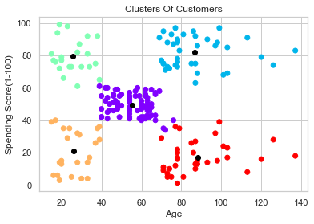


```python
X3 = df.iloc[:,1:]
wcss = []
for k in range(1,11):
    kmeans = KMeans(n_clusters=k, init='k-means++')
    kmeans.fit(X3)
    wcss.append(kmeans.inertia_)
plt.figure(figsize=(12,6))
plt.grid()
plt.plot(range(1,11),wcss,linewidth = 2, color = "red", marker = "8")
plt.xlabel('K Values')
plt.ylabel("WCSS")
plt.show()
```


    KMeans(n_clusters=1)


    KMeans(n_clusters=2)


    KMeans(n_clusters=3)


    KMeans(n_clusters=4)


    KMeans(n_clusters=5)


    KMeans(n_clusters=6)


    KMeans(n_clusters=7)


    KMeans()


    KMeans(n_clusters=9)


    KMeans(n_clusters=10)


    <Figure size 864x432 with 0 Axes>


    [<matplotlib.lines.Line2D at 0x20a33c8d340>]


    Text(0.5, 0, 'K Values')


    Text(0, 0.5, 'WCSS')


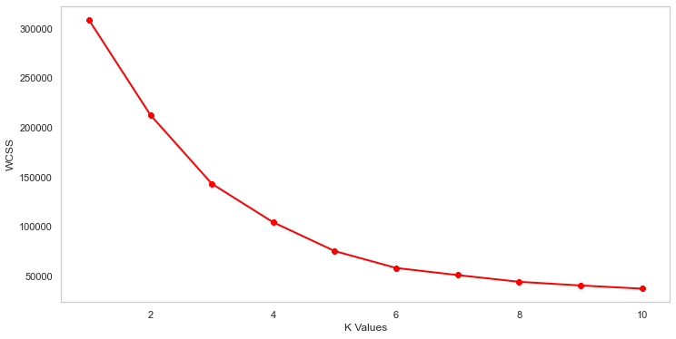


```python
kmeans = KMeans(n_clusters=5)
label = kmeans.fit_predict(X3)
print(label)
```

    [4 0 4 0 4 0 4 0 4 0 4 0 4 0 4 0 4 0 4 0 4 0 4 0 4 0 4 0 4 0 4 0 4 0 4 0 4
     0 4 0 4 0 4 2 4 0 2 2 2 2 2 2 2 2 2 2 2 2 2 2 2 2 2 2 2 2 2 2 2 2 2 2 2 2
     2 2 2 2 2 2 2 2 2 2 2 2 2 2 2 2 2 2 2 2 2 2 2 2 2 2 2 2 2 2 2 2 2 2 2 2 2
     2 2 2 2 2 2 2 2 2 2 2 2 3 1 3 2 3 1 3 1 3 1 3 1 3 1 3 1 3 1 3 2 3 1 3 1 3
     1 3 1 3 1 3 1 3 1 3 1 3 1 3 1 3 1 3 1 3 1 3 1 3 1 3 1 3 1 3 1 3 1 3 1 3 1
     3 1 3 1 3 1 3 1 3 1 3 1 3 1 3]
    


```python
print(kmeans.cluster_centers_)
```

    [[25.27272727 25.72727273 79.36363636]
     [40.66666667 87.75       17.58333333]
     [42.9375     55.0875     49.7125    ]
     [32.69230769 86.53846154 82.12820513]
     [45.2173913  26.30434783 20.91304348]]
    


```python

```


```python
clusters = kmeans.fit_predict(X3)
df['label'] = clusters

from mpl_toolkits.mplot3d import Axes3D

fig = plt.figure(figsize=(20,10))
ax = fig.add_subplot(111, projection='3d')
ax.scatter(df.Age[df.label == 0],df['Annual Income (k$)'][df.label == 0], df['Spending Score (1-100)'][df.label == 0], c='blue', s=60)
ax.scatter(df.Age[df.label == 1],df['Annual Income (k$)'][df.label == 1], df['Spending Score (1-100)'][df.label == 1], c='red', s=60)
ax.scatter(df.Age[df.label == 2],df['Annual Income (k$)'][df.label == 2], df['Spending Score (1-100)'][df.label == 2], c='green', s=60)
ax.scatter(df.Age[df.label == 3],df['Annual Income (k$)'][df.label == 3], df['Spending Score (1-100)'][df.label == 3], c='yellow', s=60)
ax.scatter(df.Age[df.label == 4],df['Annual Income (k$)'][df.label == 4], df['Spending Score (1-100)'][df.label == 4], c='purple', s=60)

ax.view_init(30,185)
plt.xlabel('Age')
plt.ylabel('Annual Income (k$)')
ax.set_zlabel('Spending Score (1-100)')
plt.show()
```


    <mpl_toolkits.mplot3d.art3d.Path3DCollection at 0x20a33cf0370>


    <mpl_toolkits.mplot3d.art3d.Path3DCollection at 0x20a33cf0820>


    <mpl_toolkits.mplot3d.art3d.Path3DCollection at 0x20a33cf0490>


    <mpl_toolkits.mplot3d.art3d.Path3DCollection at 0x20a33cf02b0>


    <mpl_toolkits.mplot3d.art3d.Path3DCollection at 0x20a33d0a130>


    Text(0.5, 0, 'Age')


    Text(0.5, 0, 'Annual Income (k$)')


    Text(0.5, 0, 'Spending Score (1-100)')


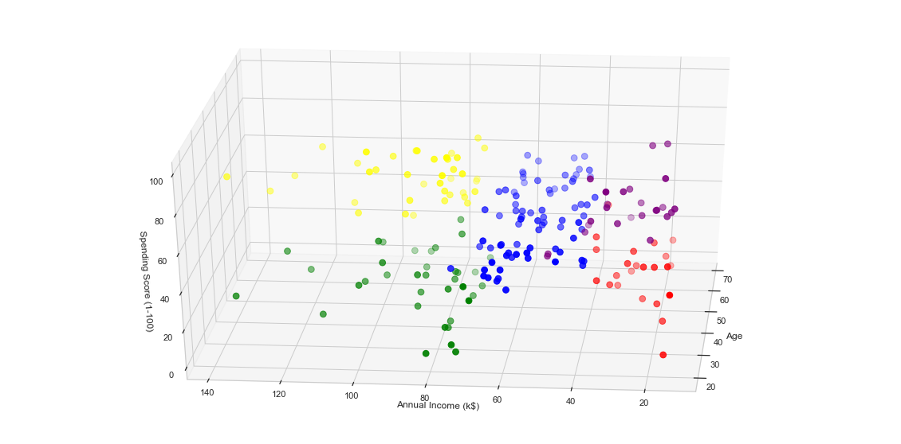

